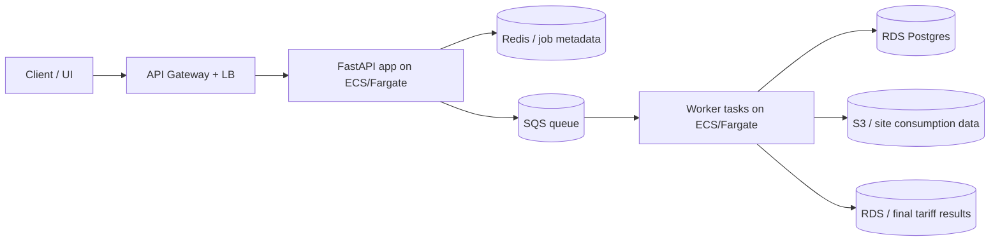

# Part B — Scale design

## 1) API contract

We keep the API thin and treat the pricing run as an async batch job.

### Submit a portfolio run

POST /api/v1/portfolio-runs

```json
{
  "portfolio_id": "port_88291",
  "as_of_date": "2026-09-27",
  "year": 2025,
  "tariff_ids": [
    "northgate_fixed_24",
    "caledon_economy_7",
    "meridian_flex_tou"
  ]
}
```

Response: 202 Accepted

```json
{
  "run_id": "run_994a2b1c",
  "status": "queued",
  "total_sites": 5000,
  "created_at": "2026-09-27T18:00:00Z"
}
```

### Poll status

GET /api/v1/portfolio-runs/{run_id}

```json
{
  "run_id": "run_994a2b1c",
  "status": "processing",
  "progress": {
    "total_sites": 5000,
    "completed_sites": 3250,
    "failed_sites": 2,
    "percent_complete": 65.0
  },
  "estimated_time_remaining_seconds": 14
}
```

### Retrieve results

GET /api/v1/portfolio-runs/{run_id}/results?page=1&limit=50

```json
{
  "run_id": "run_994a2b1c",
  "page": 1,
  "limit": 50,
  "total_results": 5000,
  "data": [
    {
      "site_id": "site_0001",
      "cheapest_tariff": "caledon_economy_7",
      "rankings": [
        {"tariff_id": "caledon_economy_7", "total_annual_gbp": 12450.20},
        {"tariff_id": "meridian_flex_tou", "total_annual_gbp": 13100.85},
        {"tariff_id": "northgate_fixed_24", "total_annual_gbp": 14200.00}
      ]
    }
  ]
}
```

A failed site is not dropped silently: it is returned with a `status: failed` and a structured error payload, while the rest of the batch continues.

## 2) Where the work goes



Why these services:

- API Gateway + ALB: public endpoint, TLS, routing, and request throttling.
- FastAPI on ECS/Fargate: matches our existing stack and keeps the API lightweight.
- SQS: decouples API submission from expensive compute and gives retry / buffering / backpressure.
- ECS/Fargate workers: run the compute in stateless containers and autoscale based on queue depth.
    eg. set a max number of workers and scale up to that max when request received. Otherwise spin down to incur no compute cost
- RDS Postgres: stores job metadata, site-level outcomes, and final results.
- S3: cheap, durable storage for source consumption files and job artefacts.
- Redis: optional but useful for short-lived job status and polling cache.

The key design decision is to move the heavy work out of the request lifecycle. The API responds quickly with `queued` / `processing`, while workers do the actual pricing.

## 3) Cost of the computation

Baseline assumptions:

- 5,000 sites
- 40 rate cards
- 17,520 half-hourly periods per site per year
- 5,000 x 40 = 200,000 site/tariff calculations

Approximate arithmetic:

- 87.6 million half-hourly rows in total for the portfolio
- each row does a small amount of arithmetic: multiply `kwh` by a tariff rate, plus a few branch checks
- in rough terms the workload is a few hundred million decimal ops, which is cheap for a distributed batch but too expensive for a serial API request

A single worker with a naive implementation might take tens of minutes if run serially. I would therefore shard by site and use a fixed worker pool with autoscaling on SQS queue depth. A reasonable target is 10–50 worker tasks depending on backlog, so the batch stays in the low tens of seconds to a couple minutes rather than the half-hour range.

If the arithmetic gets heavy enough, the one internal interface I would change is to pass a precomputed per-site consumption vector or a compact in-memory aggregation by band, rather than re-reading thousands of raw rows per rate card.

## 4) Partial failure

If 3 of 5,000 sites fail because their ingestion data is unusable:

- the run stays `processing` until the failed subset is counted
- each failed site is written to Postgres with a structured failure record, e.g. `site_status = failed`, `error_code = invalid_consumption_data`
- the caller sees a `failed_sites` count in the `/status` response and a result payload that includes per-site errors
- retry is idempotent: retry only the failed site IDs, not the full portfolio run

This keeps the good sites moving while preserving auditability for the bad ones.

## 5) Idempotency

We prevent duplicates with a deterministic run key:

- `portfolio_id + year + tariff_set + as_of_date` forms the logical run identity
- the API stores a unique constraint on that key in Postgres
- workers read site tasks from SQS with a message deduplication / idempotency token, and write results only if the target `(run_id, site_id, tariff_id)` row does not already exist

This means:

- the same run submitted twice returns the same `run_id` or a 409 duplicate response
- a worker retry after a crash does not create duplicate result rows
- output remains consistent even if the same message is delivered more than once

## Summary

This is a standard async batch design: submit a job, poll progress, and retrieve curated results later. It matches our existing stack and keeps the API responsive while letting compute scale horizontally with queue depth and site count.